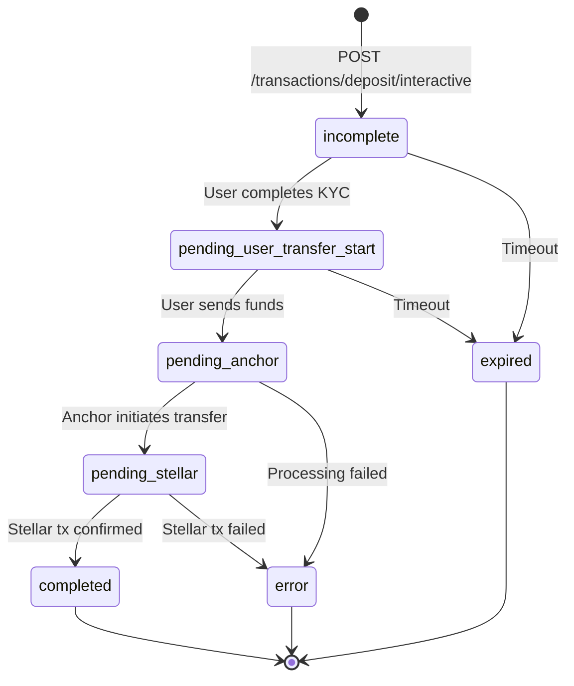

# SEP Reference: Architecture Proposal

**Project Name:** `sep-reference`  
**Repository:** `github.com/stellar/sep-reference`  
**Author:** Stellar Development Foundation  
**Status:** Draft  
**Date:** June 2025

---

## Executive Summary

SEP Reference is a comprehensive resource package designed to accelerate the implementation of Stellar Ecosystem Proposals (SEPs) for anchor services. Rather than providing a single opinionated library, SEP Reference offers a layered approach: machine-readable specifications, reference implementations, and AI-optimized implementation guides that enable developers to build compliant services in any language.

The goal is to reduce time-to-production for new anchor services from months to weeks while maintaining security and compliance standards.

---

## Table of Contents

1. [Problem Statement](#problem-statement)
2. [Design Philosophy](#design-philosophy)
3. [Naming Rationale](#naming-rationale)
4. [Repository Structure](#repository-structure)
5. [Component Specifications](#component-specifications)
6. [Integration with Existing Infrastructure](#integration-with-existing-infrastructure)
7. [Implementation Phases](#implementation-phases)
8. [Success Metrics](#success-metrics)
9. [Open Questions](#open-questions)

---

## Problem Statement

### Current State

Developers building Stellar anchor services today face several challenges:

1. **Fragmented Resources**: SEP specifications live in `stellar-protocol`, reference code exists in various states across multiple repositories, and practical guidance is scattered.

2. **Operational Overhead**: The Anchor Platform provides comprehensive SEP compliance but requires running an additional service with its own database. While developers can implement their business logic in any language, they must still configure, deploy, and maintain the Anchor Platform infrastructure—requiring DevOps expertise and adding operational complexity.

3. **Configuration Complexity**: The Anchor Platform has extensive configuration options that can be challenging to set up correctly. Developers must understand the interplay between their business logic service and the Anchor Platform, manage the integration points, and troubleshoot issues across service boundaries.

4. **Specification Ambiguity**: SEP documents are written for human readers and often leave edge cases underspecified. Developers discover compliance issues only when running integration tests.

5. **High Implementation Cost**: Building a compliant SEP-10 + SEP-24 service from scratch typically requires 4-8 weeks of development time, even for experienced teams.

### Desired State

- A developer can understand, implement, and validate a SEP-compliant service in **any language** within **1-2 weeks**
- Implementation correctness is verifiable through automated testing before deployment
- AI-assisted development is a first-class use case, with specifications optimized for LLM consumption
- The learning curve from "what is SEP-10?" to "production-ready service" is smooth and well-documented

---

## Design Philosophy

### Principles

1. **Specs as Source of Truth**  
   Machine-readable specifications (OpenAPI, JSON Schema, test vectors) are authoritative. Reference implementations are derivatives that demonstrate the specs in practice.

2. **Validation Over Prescription**  
   We provide tools to verify correctness, not mandates on how to achieve it. Developers choose their architecture; we confirm it works.

3. **AI-Native Documentation**  
   Implementation guides are structured for both human comprehension and LLM consumption. A developer should be able to paste an AI spec into Claude or GPT and receive a working implementation scaffold.

4. **Copy-Paste Friendly**  
   Reference code prioritizes readability and adaptability over abstraction. Developers should be able to extract individual files and integrate them into their codebase without dependency chains.

5. **Progressive Disclosure**  
   Resources are layered by complexity. Quick starts get developers running fast; deep dives explain edge cases and security considerations.

### What SEP Reference Is NOT

- **Not a framework**: We don't impose application structure or require specific dependencies
- **Not a hosted service**: All resources are self-contained for local/on-premise deployment
- **Not a replacement for Anchor Platform**: Teams already invested in Anchor Platform infrastructure, or those who prefer a managed SEP-compliance service, should continue using it
- **Not documentation**: Conceptual and tutorial documentation lives in `stellar-docs`

---

## Repository Structure

```
sep-reference/
├── README.md
├── LICENSE
├── CONTRIBUTING.md
│
├── specs/                          # Machine-readable specifications
│   ├── sep10/
│   │   ├── openapi.yaml            # API contract (OpenAPI 3.1)
│   │   ├── ai-spec.md              # LLM-optimized implementation guide
│   │   ├── test-vectors.json       # Canonical input/output examples
│   │   └── state-machine.md        # Protocol states and transitions
│   │
│   ├── sep24/
│   │   ├── openapi.yaml
│   │   ├── ai-spec.md
│   │   ├── test-vectors.json
│   │   └── state-machine.md
│   │
│   └── shared/
│       ├── sep1.schema.json        # stellar.toml JSON Schema
│       ├── sep9-fields.json        # KYC field definitions
│       └── jwt.schema.json         # SEP-10 JWT structure
│
├── reference/                      # Working implementations
│   └── go/
│       ├── cmd/
│       │   ├── server/             # Runnable anchor server
│       │   │   └── main.go
│       │   └── wallet-cli/         # CLI client for testing
│       │       └── main.go
│       │
│       ├── sep10/
│       │   ├── challenge.go        # Challenge transaction building
│       │   ├── verify.go           # Signature verification
│       │   ├── jwt.go              # Token issuance and validation
│       │   ├── handler.go          # HTTP handlers
│       │   └── handler_test.go
│       │
│       ├── sep24/
│       │   ├── info.go             # GET /info
│       │   ├── deposit.go          # Deposit flow
│       │   ├── withdraw.go         # Withdrawal flow
│       │   ├── transaction.go      # Transaction queries
│       │   ├── state.go            # Transaction state machine
│       │   ├── handler.go          # HTTP handlers
│       │   ├── handler_test.go
│       │   └── interactive/        # Minimal web UI
│       │       ├── templates/
│       │       │   ├── deposit.html
│       │       │   ├── withdraw.html
│       │       │   └── status.html
│       │       └── static/
│       │           └── styles.css
│       │
│       ├── sep1/
│       │   └── toml.go             # stellar.toml generation/serving
│       │
│       ├── internal/
│       │   ├── config/             # Configuration management
│       │   │   └── config.go
│       │   ├── db/                 # Transaction storage interface
│       │   │   ├── interface.go
│       │   │   └── memory.go       # In-memory implementation
│       │   └── middleware/         # Common HTTP middleware
│       │       └── auth.go
│       │
│       ├── go.mod
│       ├── go.sum
│       ├── Makefile
│       ├── Dockerfile
│       ├── docker-compose.yml      # Full stack for local testing
│       ├── .env.example
│       └── README.md
│
└── examples/                       # Minimal standalone examples
    ├── sep10-minimal/              # Bare minimum SEP-10 server
    │   └── main.go                 # Single-file, ~200 lines
    └── sep24-minimal/              # Bare minimum SEP-24 server
        └── main.go
```

---

## Component Specifications

### 1. AI Specs (`specs/*/ai-spec.md`)

#### Purpose
Provide implementation specifications optimized for consumption by both humans and large language models. These documents enable developers to generate working implementations in any programming language.

#### Structure

```markdown
# SEP-{N}: {Title}

## Overview
{2-3 sentence description of purpose and scope}

## Quick Reference
- Depends on: SEP-1, SEP-10 (if applicable)
- Endpoints: GET /auth, POST /auth (list all)
- Authentication: {None | SEP-10 JWT}

## Terminology
{Glossary of SEP-specific terms}

## Architecture

### Roles
- **Server (Anchor)**: {responsibilities}
- **Client (Wallet)**: {responsibilities}

### Flow Diagram
{Mermaid sequence diagram}

## Implementation Requirements

### Server MUST
- [ ] {Requirement with specific, testable criteria}
- [ ] {Another requirement}

### Server MUST NOT
- [ ] {Anti-pattern or security violation}

### Server SHOULD
- [ ] {Recommendation}

## Endpoint Specifications

### {METHOD} {/path}

**Purpose**: {One sentence}

**Authentication**: {Required | None}

**Request**:
| Parameter | Type | Required | Description |
|-----------|------|----------|-------------|
| {name} | {type} | {yes/no} | {description} |

**Response** (Success - 200):
```json
{
  "field": "example value"
}
```

**Response** (Error - 400/401/403):
```json
{
  "error": "description"
}
```

**Implementation Notes**:
1. {Specific implementation detail}
2. {Edge case handling}

**Example**:
```bash
curl -X GET "https://example.com/auth?account=GABC..."
```

## Security Considerations
{Explicit security requirements and common vulnerabilities}

## Test Vectors
{Reference to test-vectors.json with explanation}

## Common Implementation Mistakes
{List of errors that implementations frequently make, especially useful for LLM generation}

1. **{Mistake}**: {Why it's wrong and how to fix it}
2. **{Another mistake}**: {Explanation}

## Validation
Run the Stellar Anchor Tests suite to verify compliance:
```bash
npx @stellar/anchor-tests --home-domain your-domain.com --seps {N}
```
```

#### Quality Criteria for AI Specs

- **Completeness**: Every endpoint, parameter, and response is documented
- **Precision**: Requirements use RFC 2119 language (MUST, SHOULD, MAY)
- **Examples**: Every endpoint includes request/response examples
- **Testability**: Requirements map to specific test cases
- **Negative Cases**: Documents what NOT to do, not just what to do

---

### 2. OpenAPI Specifications (`specs/*/openapi.yaml`)

#### Purpose
Provide machine-readable API contracts that can be used for:
- Client SDK generation
- Server stub generation
- Request/response validation
- Interactive documentation (Swagger UI)

#### Requirements

- OpenAPI 3.1 specification
- Complete request/response schemas with examples
- Error response schemas for all error codes
- Security scheme definitions (SEP-10 JWT where applicable)
- Webhook callback schemas (for SEP-24 callbacks)

#### Example Structure

```yaml
openapi: 3.1.0
info:
  title: SEP-10 Stellar Web Authentication
  version: 1.0.0
  description: |
    API specification for SEP-10 authentication flow.
    
servers:
  - url: https://example.com
    description: Example server

paths:
  /auth:
    get:
      operationId: getChallenge
      summary: Request authentication challenge
      parameters:
        - name: account
          in: query
          required: true
          schema:
            type: string
            pattern: '^G[A-Z2-7]{55}$'
          description: Stellar account ID (G... address)
        - name: memo
          in: query
          schema:
            type: string
          description: Memo to attach to challenge (for custodial wallets)
        # ... additional parameters
      responses:
        '200':
          description: Challenge transaction
          content:
            application/json:
              schema:
                $ref: '#/components/schemas/ChallengeResponse'
              example:
                transaction: "AAAAAgAAAAA..."
                network_passphrase: "Test SDF Network ; September 2015"
        '400':
          $ref: '#/components/responses/BadRequest'

components:
  schemas:
    ChallengeResponse:
      type: object
      required:
        - transaction
        - network_passphrase
      properties:
        transaction:
          type: string
          description: Base64-encoded XDR transaction envelope
        network_passphrase:
          type: string
          description: Network passphrase for the Stellar network
          
  securitySchemes:
    sep10Auth:
      type: http
      scheme: bearer
      bearerFormat: JWT
      description: JWT token obtained from SEP-10 authentication
```

---

### 3. Test Vectors (`specs/*/test-vectors.json`)

#### Purpose
Provide canonical input/output pairs for validating implementations without running the full test suite. Useful for:
- Unit testing specific functions
- LLM-assisted implementation validation
- Edge case documentation

#### Structure

```json
{
  "version": "1.0.0",
  "sep": 10,
  "vectors": [
    {
      "id": "valid-challenge-generation",
      "description": "Server generates valid challenge for account",
      "type": "challenge_generation",
      "input": {
        "server_signing_key": "GBXXX...SERVER",
        "server_secret_key": "SBXXX...SECRET",
        "client_account": "GCXXX...CLIENT",
        "home_domain": "example.com",
        "web_auth_domain": "example.com",
        "network_passphrase": "Test SDF Network ; September 2015",
        "timeout_seconds": 300,
        "nonce": "abc123def456..."
      },
      "expected": {
        "transaction_source": "GBXXX...SERVER",
        "sequence_number": 0,
        "operations": [
          {
            "type": "manage_data",
            "source": "GCXXX...CLIENT",
            "name": "example.com auth",
            "value_base64": "YWJjMTIzZGVmNDU2Li4u"
          },
          {
            "type": "manage_data",
            "source": "GBXXX...SERVER",
            "name": "web_auth_domain",
            "value": "example.com"
          }
        ],
        "signatures": ["server_signature_present"]
      }
    },
    {
      "id": "invalid-wrong-source",
      "description": "Challenge with wrong source account should fail verification",
      "type": "verification_failure",
      "input": {
        "challenge_xdr": "AAAAAgAAAAB...",
        "server_signing_key": "GBXXX...SERVER",
        "network_passphrase": "Test SDF Network ; September 2015"
      },
      "expected": {
        "valid": false,
        "error_code": "INVALID_SOURCE_ACCOUNT",
        "error_message": "Challenge source account does not match server signing key"
      }
    }
  ]
}
```

---

### 4. State Machine Documentation (`specs/*/state-machine.md`)

#### Purpose
Document the valid states and transitions for stateful protocols (primarily SEP-24).

#### Structure

```markdown
# SEP-24 Transaction State Machine

## States

| State | Description | Terminal |
|-------|-------------|----------|
| `incomplete` | User has not yet completed interactive flow | No |
| `pending_user_transfer_start` | Waiting for user to send funds | No |
| `pending_anchor` | Anchor processing the transaction | No |
| `pending_stellar` | Stellar transaction submitted, awaiting confirmation | No |
| `completed` | Transaction successfully completed | Yes |
| `error` | Transaction failed | Yes |
| `expired` | Transaction expired before completion | Yes |

## State Diagram



## Transition Rules

### incomplete → pending_user_transfer_start
**Trigger**: User completes required interactive steps (KYC, amount selection)
**Anchor Action**: Update transaction status, provide deposit instructions
**Required Fields After**: `amount_in`, `amount_out`, `amount_fee`

### pending_user_transfer_start → pending_anchor
**Trigger**: Anchor detects incoming funds
**Anchor Action**: Begin processing, validate amount matches expected
**Required Fields After**: `amount_in_received`

...
```

---

### 5. Go Reference Implementation (`reference/go/`)

#### Design Principles

1. **Flat Package Structure**  
   Avoid deep nesting. Each SEP is a top-level package.

2. **Minimal Dependencies**  
   Core implementation depends only on:
   - `github.com/stellar/go-stellar-sdk` (Stellar SDK)
   - `github.com/golang-jwt/jwt/v5` (JWT handling)
   - Standard library for HTTP, crypto

3. **Interface-Based Storage**  
   Transaction storage is abstracted behind interfaces. Reference includes in-memory implementation; production deployments provide their own.

4. **Configuration via Environment**  
   All configuration through environment variables with sensible defaults.

5. **Comprehensive Comments**  
   Every public function includes:
   - Purpose description
   - Parameter explanations
   - Return value documentation
   - Reference to relevant SEP section

#### File Conventions

```go
// sep10/challenge.go

// Package sep10 implements SEP-10: Stellar Web Authentication.
// See: https://github.com/stellar/stellar-protocol/blob/master/ecosystem/sep-0010.md
package sep10

import (
    "crypto/rand"
    "encoding/base64"
    "time"

    "github.com/stellar/go-stellar-sdk/keypair"
    "github.com/stellar/go-stellar-sdk/txnbuild"
)

// ChallengeParams contains the parameters for building a challenge transaction.
type ChallengeParams struct {
    // ServerKey is the keypair of the server's signing key.
    // This key signs the challenge and is published in the stellar.toml.
    ServerKey *keypair.Full

    // ClientAccountID is the Stellar account ID (G...) of the client
    // requesting authentication.
    ClientAccountID string

    // HomeDomain is the domain of the service (e.g., "example.com").
    // This value appears in the first ManageData operation.
    HomeDomain string

    // WebAuthDomain is the domain hosting the auth endpoint.
    // Usually the same as HomeDomain. Included as a ManageData operation
    // to prevent certain phishing attacks.
    WebAuthDomain string

    // Timeout specifies how long the challenge is valid.
    // Default: 5 minutes. Maximum recommended: 15 minutes.
    Timeout time.Duration

    // NetworkPassphrase identifies the Stellar network.
    // Use network.TestNetworkPassphrase or network.PublicNetworkPassphrase.
    NetworkPassphrase string

    // Memo is an optional memo to include, used for custodial wallets
    // where multiple users share an account.
    Memo *txnbuild.MemoID
}

// BuildChallenge creates a SEP-10 challenge transaction.
//
// The challenge is a Stellar transaction that:
// - Has source account = server signing key
// - Has sequence number = 0 (making it invalid for submission)
// - Contains a ManageData operation with client as source
// - Is signed by the server
//
// The client must sign this transaction and return it to prove
// ownership of their account.
//
// Reference: SEP-10 Section "Challenge"
// https://github.com/stellar/stellar-protocol/blob/master/ecosystem/sep-0010.md#challenge
func BuildChallenge(params ChallengeParams) (*txnbuild.Transaction, error) {
    // Set default timeout if not specified
    if params.Timeout == 0 {
        params.Timeout = 5 * time.Minute
    }

    // Generate cryptographically random nonce (64 bytes per SEP-10)
    nonce := make([]byte, 64)
    if _, err := rand.Read(nonce); err != nil {
        return nil, fmt.Errorf("generating nonce: %w", err)
    }

    // Build the challenge transaction
    // See reference implementation for complete details
    // ...
}
```

#### Runnable Server (`cmd/server/main.go`)

The reference server should start with a single command:

```bash
# Set required environment variables
export SIGNING_KEY="SBXXX..."
export HOME_DOMAIN="localhost:8080"
export NETWORK_PASSPHRASE="Test SDF Network ; September 2015"

# Run the server
go run ./cmd/server

# Output:
# 2026/02/03 10:30:00 SEP Reference server starting
# 2026/02/03 10:30:00 SEP-1:  http://localhost:8080/.well-known/stellar.toml
# 2026/02/03 10:30:00 SEP-10: http://localhost:8080/auth
# 2026/02/03 10:30:00 SEP-24: http://localhost:8080/sep24
# 2026/02/03 10:30:00 Ready to accept connections
```

---

## Integration with Existing Infrastructure

### Stellar Anchor Tests (`@stellar/anchor-tests`)

SEP Reference implementations are validated using the existing test suite maintained at `github.com/stellar/stellar-anchor-tests`.

#### Integration Points

1. **CI Pipeline**: Reference implementation runs anchor-tests on every PR
2. **Documentation**: AI specs reference specific test cases
3. **Local Development**: docker-compose includes anchor-tests service

```yaml
# docker-compose.yml (excerpt)
services:
  server:
    build: .
    ports:
      - "8080:8080"
    environment:
      - SIGNING_KEY=${SIGNING_KEY}
      - HOME_DOMAIN=server:8080

  anchor-tests:
    image: stellar/anchor-tests:latest
    depends_on:
      - server
    command: >
      --home-domain http://server:8080
      --seps 1 10 24
      --verbose
```

#### Validation Workflow

```
Developer implements SEP-10
         │
         ▼
┌─────────────────────────────┐
│  Run local unit tests       │
│  go test ./sep10/...        │
└─────────────────────────────┘
         │
         ▼
┌─────────────────────────────┐
│  Start reference server     │
│  go run ./cmd/server        │
└─────────────────────────────┘
         │
         ▼
┌─────────────────────────────┐
│  Run anchor-tests           │
│  npx @stellar/anchor-tests  │
│    --home-domain localhost  │
│    --seps 10                │
└─────────────────────────────┘
         │
         ▼
   ✓ All tests pass = Compliant
```

### Stellar Documentation (`stellar-docs`)

All conceptual and tutorial documentation lives in the stellar-docs repository. SEP Reference contains only inline code comments and README files that link to external documentation.

#### Documentation to Create in stellar-docs

| Document | Location | Purpose |
|----------|----------|---------|
| SEP Reference Overview | `/docs/build/apps/sep-reference/overview.md` | Introduction and when to use |
| Quickstart Guide | `/docs/build/apps/sep-reference/quickstart.md` | Get running in 15 minutes |
| SEP-10 Implementation Guide | `/docs/build/apps/sep-reference/sep10.md` | Detailed implementation walkthrough |
| SEP-24 Implementation Guide | `/docs/build/apps/sep-reference/sep24.md` | Detailed implementation walkthrough |
| Production Checklist | `/docs/build/apps/sep-reference/production.md` | Security review, scaling, monitoring |
| Using AI Specs | `/docs/build/apps/sep-reference/ai-specs.md` | How to use specs with LLMs |
| Comparison: SEP Reference vs Anchor Platform | `/docs/build/apps/sep-reference/comparison.md` | Help developers choose the right approach |

#### Cross-Reference Pattern

SEP Reference README links to docs:

```markdown
## Documentation

- [Overview](https://developers.stellar.org/docs/build/apps/sep-reference/overview)
- [Quickstart](https://developers.stellar.org/docs/build/apps/sep-reference/quickstart)
- [SEP-10 Guide](https://developers.stellar.org/docs/build/apps/sep-reference/sep10)
- [SEP-24 Guide](https://developers.stellar.org/docs/build/apps/sep-reference/sep24)
```

AI specs reference test suite:

```markdown
## Validation

Verify your implementation using the Stellar Anchor Tests:

```bash
npx @stellar/anchor-tests --home-domain your-domain.com --seps 10
```

See the [test suite documentation](https://github.com/stellar/stellar-anchor-tests) for configuration options.
```

---

## Implementation Phases

### Phase 1: Foundation (Weeks 1-4)

**Goal**: Deliver SEP-10 support with full specification and reference implementation.

| Week | Deliverables |
|------|--------------|
| 1 | Repository setup, CI/CD, SEP-10 ai-spec.md first draft |
| 2 | SEP-10 OpenAPI spec, test vectors, ai-spec.md refinement |
| 3 | Go reference implementation for SEP-10 (server + client) |
| 4 | Integration with anchor-tests, documentation PRs to stellar-docs |

**Exit Criteria**:
- `npx @stellar/anchor-tests --seps 1 10` passes against reference
- AI spec successfully used to generate Python implementation (validation)
- Quickstart doc enables new developer to run server in <15 minutes

### Phase 2: SEP-24 Core (Weeks 5-8)

**Goal**: Complete SEP-24 deposit/withdrawal flows.

| Week | Deliverables |
|------|--------------|
| 5 | SEP-24 ai-spec.md, state-machine.md |
| 6 | SEP-24 OpenAPI spec, test vectors |
| 7 | Go reference implementation (deposit, withdrawal, transaction queries) |
| 8 | Interactive UI templates, docker-compose full stack |

**Exit Criteria**:
- `npx @stellar/anchor-tests --seps 1 10 24` passes
- End-to-end deposit flow works via reference wallet CLI
- SEP-24 guide published in stellar-docs

### Phase 3: Polish & Adoption (Weeks 9-12)

**Goal**: Production readiness and community adoption.

| Week | Deliverables |
|------|--------------|
| 9 | Security review of reference implementation |
| 10 | Production checklist doc, performance testing |
| 11 | Community feedback integration, additional examples |
| 12 | Public announcement, office hours, feedback collection |

**Exit Criteria**:
- At least 2 external teams have used SEP Reference to build services
- No critical security issues in reference implementation
- Community feedback incorporated into roadmap

### Future Phases (Scoped Out)

- **SEP-6**: Programmatic deposit/withdrawal (non-interactive)
- **SEP-12**: KYC API integration
- **SEP-31**: Cross-border payments
- **SEP-38**: Anchor RFQ API
- **Additional Languages**: Rust, Python, TypeScript reference implementations (community-driven)

---

## Success Metrics

### Quantitative

| Metric | Target | Measurement |
|--------|--------|-------------|
| Time to first working server | <4 hours | User surveys, time tracking in quickstart |
| Time to production deployment | <2 weeks | Follow-up surveys with adopters |
| Anchor-tests pass rate | 100% | CI pipeline |
| GitHub stars | >200 in 6 months | GitHub metrics |
| Community implementations | >5 languages | Tracking community forks/implementations |

### Qualitative

| Signal | Assessment Method |
|--------|-------------------|
| AI spec quality | Can generate working implementation from spec alone |
| Reference code clarity | Code review feedback, community contributions |
| Documentation completeness | Support ticket volume, Discord questions |
| Developer satisfaction | NPS survey of anchor builders |

---

## Open Questions

### Technical

1. **Storage Interface Scope**: Should reference include PostgreSQL implementation, or only in-memory?
   - *Recommendation*: In-memory only in reference; PostgreSQL as documented example in stellar-docs

2. **Multi-tenancy**: Should reference support multiple assets/services?
   - *Recommendation*: Single asset in reference; document multi-tenancy patterns

3. **Custody Integration**: How deep should custody wallet integration go?
   - *Recommendation*: Document patterns, don't implement specific custody solutions

### Organizational

1. **Maintenance Commitment**: What SLA for security patches and updates?
   - *Recommendation*: Security patches within 48 hours; feature updates quarterly

2. **Community Contributions**: What contribution model for reference implementations in other languages?
   - *Recommendation*: Community maintains non-Go implementations under `stellar-community` org with SDF providing specs and test suite

3. **Anchor Platform Relationship**: How to position relative to existing Anchor Platform?
   - *Recommendation*: Anchor Platform for teams wanting a managed SEP-compliance service they configure and run alongside their business logic; SEP Reference for teams wanting to implement SEP compliance directly in their codebase without additional infrastructure. Both are valid choices.

---

## Appendix A: AI Spec Template

See `specs/templates/ai-spec-template.md` for the full template used to create AI specs.

## Appendix B: Related Resources

- [SEP Index](https://github.com/stellar/stellar-protocol/tree/master/ecosystem)
- [Stellar Anchor Tests](https://github.com/stellar/stellar-anchor-tests)
- [Anchor Platform](https://github.com/stellar/java-stellar-anchor-sdk)
- [Stellar Documentation](https://developers.stellar.org)

---

*This document is a living proposal. Feedback welcome via GitHub issues or Stellar Developer Discord.*