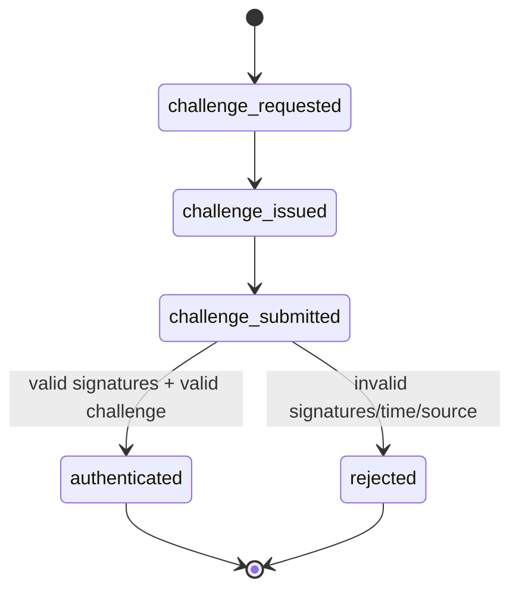

# SEP-10 Authentication State Machine

## States

| State | Description | Terminal |
|---|---|---|
| `challenge_requested` | Client requested challenge via `GET /auth` | No |
| `challenge_issued` | Server returned challenge transaction | No |
| `challenge_submitted` | Client submitted signed challenge via `POST /auth` | No |
| `authenticated` | Server validated challenge and issued JWT | Yes |
| `rejected` | Server rejected challenge | Yes |

## State Diagram

