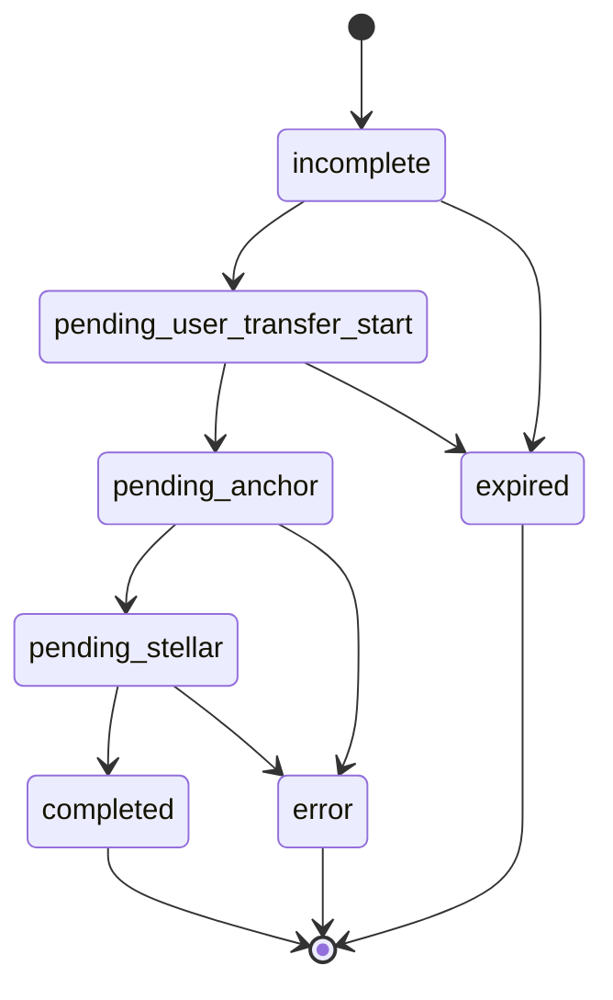

# SEP-24 Transaction State Machine

## States

| State | Description | Terminal |
|---|---|---|
| `incomplete` | Interactive flow started but not finished | No |
| `pending_user_transfer_start` | Waiting for user to send funds | No |
| `pending_anchor` | Anchor processing transfer | No |
| `pending_stellar` | Stellar transaction submitted | No |
| `completed` | Transaction completed successfully | Yes |
| `error` | Transaction failed | Yes |
| `expired` | Interactive flow timed out | Yes |

## Transition Guards

- `incomplete -> pending_user_transfer_start` requires interactive form completion.
- `pending_user_transfer_start -> pending_anchor` requires incoming funds detection.
- `pending_anchor -> pending_stellar` requires successful internal processing.
- `pending_stellar -> completed` requires confirmed Stellar settlement.
- Any non-terminal state may transition to `error` with explicit failure reason.

## State Diagram

